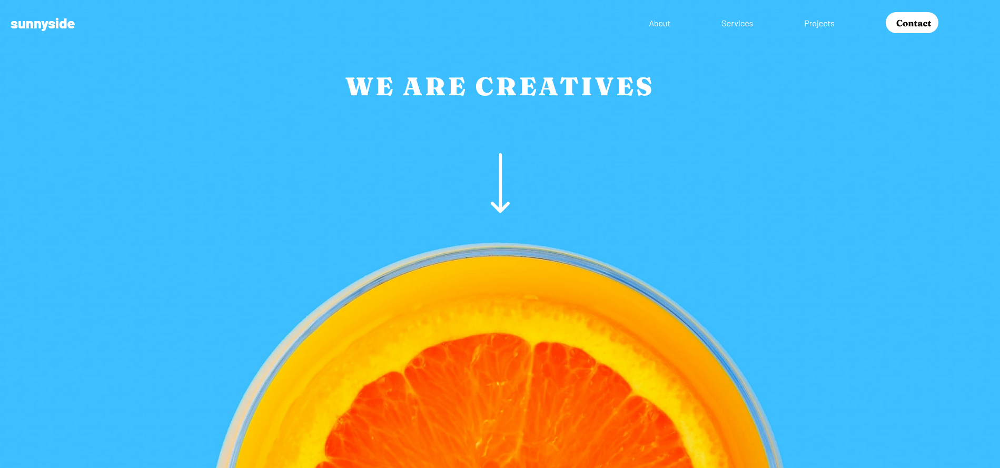

# Frontend Mentor - Sunnyside agency landing page

## About

Vanilla CSS and JS. Was pretty fun learning how to use grid for the layout of the page. Pretty straightforward and I really like the color palette of the original designs.

Had some issues finding the right scaling for medium sized screens. The large and mobile views turned out pretty well i thought.

View the project here: https://palettejack.github.io/FEM_Sunnyside-agency-landing-page/